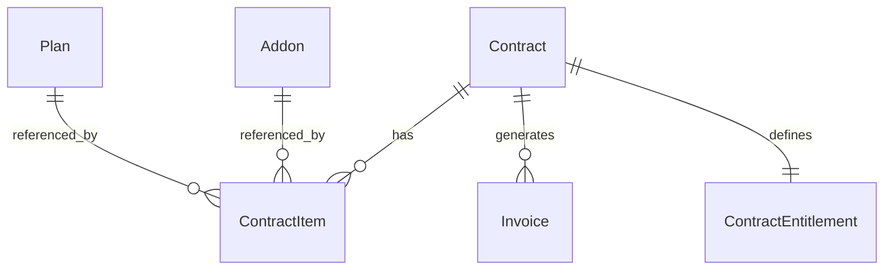

A seguir está um **PRD + Sprints** já estruturado para você colar no Codex e ele implementar com clareza. Eu escrevi no nível “gerente de SaaS + arquiteto de produto”, com **requisitos, regras, modelo de dados, APIs, UX e critérios de aceite**.

---

# PRD — Módulo de Contratos, Cobrança e Métricas (MRR/ARR)

## 1) Contexto e Problema

O sistema é um **SaaS** onde o “dono” vende **treinamentos recorrentes** e **consultorias**, buscando **receita recorrente (MRR/ARR)**. Porém há contratos com **anuidade**, e a modelagem atual de “Contrato” está genérica, misturando:

* vigência (direito de uso/entrega)
* cobrança (faturamento/caixa)
* itens/oferta (o que foi vendido)
* limites (entitlements)

Isso causa problemas práticos:

* Dificuldade para representar **anuidade à vista vs anuidade parcelada**
* Não existe **itens do contrato** (plano + add-ons), apenas “valor solto”
* Limites (funcionários) ficam desconectados do uso real
* Métricas (MRR/ARR) ficam erradas sem regra para anual
* UX confusa (busca + cadastro na mesma tela)

## 2) Objetivos

### Objetivo principal

Criar um módulo de **Contratos/Assinaturas** que suporte:

* **Vigência** separada de **cobrança**
* **Planos + Add-ons (itens)** com totais calculados
* **Entitlements** (limites) com monitoramento de uso e política de excedente
* Métricas **MRR** e **ARR** consistentes (incluindo anual)

### Objetivos secundários

* Melhorar UX com:

  * **Lista de contratos** (com filtros e ações)
  * **Wizard de criação/edição** em etapas
* Preparar base para faturamento:

  * **Faturas (invoices)** e status de pagamento
  * Próxima cobrança e suspensão por inadimplência

## 3) Fora do Escopo (MVP)

* Integração com gateway (Stripe/MercadoPago/Inter) — pode ficar para fase 2
* Emissão fiscal (NFSe) — fase futura
* Automação de e-mails/WhatsApp — fase futura (mas deixe ganchos)

## 4) Personas

1. **SaaS Admin (Dono)**

* Cria planos, add-ons, regras e contratos
* Acompanha MRR/ARR, inadimplência, renovações

2. **Cliente Admin**

* Visualiza contrato e limites
* Gerencia funcionários/usuários e consumo
* Vê status de cobrança e faturas

## 5) Conceitos e Definições (importante)

* **Vigência (Term):** período de direito de uso/entrega (ex: 12 meses)
* **Cobrança (Billing):** como o cliente paga (mensal, anual à vista, anual parcelado)
* **Itens do contrato:** plano base + add-ons (consultoria, pacotes, horas, módulos)
* **Entitlements:** limites e permissões contratadas (ex: limite de funcionários)

> Regra de ouro: **anuidade ≠ cobrança anual**
> Um contrato pode ter **vigência anual** e cobrança **mensal parcelada (12x)**.

## 6) Regras de Negócio (MVP)

### 6.1 Vigência

* Contrato tem:

  * `startDate` (obrigatório)
  * `termMonths` (1, 3, 6, 12, custom)
  * `autoRenew` (bool)
  * `renewalDate` (calculada: startDate + termMonths)
* `endDate` só é preenchido se:

  * cancelado
  * expirado sem autoRenew
  * encerrado manualmente

### 6.2 Cobrança

* Campos:

  * `billingModel`:

    * `MONTHLY`
    * `ANNUAL_UPFRONT` (anual à vista)
    * `ANNUAL_INSTALLMENTS` (anual parcelado em 12)
    * `CUSTOM`
  * `billingDay` (1–28) quando aplicável
  * `nextBillingDate`
  * `paymentMethod`: `PIX | BOLETO | CARD | TRANSFER`
  * `paymentTermsDays` (0, 7, 15, 30)
  * `billingStatus`: `ON_TIME | PAST_DUE | SUSPENDED`
* Geração de “fatura”:

  * Para MVP: criar registro de fatura com valor e vencimento (sem integração)

### 6.3 Itens do contrato

* Contrato deve possuir 1+ itens:

  * `type: PLAN | ADDON`
  * `refId` (plano/add-on)
  * `quantity`
  * `unitPrice`
  * `discountType: NONE | PERCENT | AMOUNT`
  * `discountValue`
  * `totalItem = (unitPrice * quantity) - desconto`
* Total do contrato:

  * `total = soma(totalItem)`
* Deve suportar upgrades:

  * Troca de plano/add-on com histórico (pode ser fase 1.5)

### 6.4 Entitlements (limites)

* Exemplo principal:

  * `employeeLimit`
* Monitoramento:

  * `employeesUsed` é calculado do cadastro de funcionários
  * Alertas:

    * 80% do limite: warning
    * 100%: crítico
* Política de excedente (`overagePolicy`)

  * `BLOCK` (bloqueia cadastro acima do limite)
  * `ALLOW_AND_CHARGE` (deixa passar e gera cobrança extra — fase 2)
  * `ALLOW_AND_WARN` (deixa passar e só alerta)

### 6.5 Métricas MRR/ARR

* MRR do contrato ativo:

  * Se `MONTHLY`: `MRR = totalMensal`
  * Se `ANNUAL_UPFRONT`: `MRR = totalAnual / 12`
  * Se `ANNUAL_INSTALLMENTS`: `MRR = totalAnual / 12`
* ARR:

  * `ARR = MRR * 12`
* Dashboard:

  * Total contratos
  * Contratos ativos
  * MRR ativo
  * (opcional MVP) ARR ativo

## 7) Requisitos Funcionais

### 7.1 Admin — Lista de Contratos

* Exibir tabela:

  * Cliente | Plano | BillingModel | Próxima cobrança | Status contrato | BillingStatus | MRR | Ações
* Filtros:

  * busca (cliente/plano)
  * status contrato
  * billing status
* Ações:

  * criar contrato
  * editar contrato
  * pausar/cancelar
  * visualizar detalhes

### 7.2 Admin — Wizard “Novo/Editar Contrato”

**Etapas:**

1. **Cliente**
2. **Oferta (Itens)**
3. **Vigência & Renovação**
4. **Cobrança & Pagamento**
5. **Resumo e Confirmação**

**Resumo lateral (sempre visível):**

* Total mensal / total anual (se aplicável)
* MRR calculado
* Próxima cobrança (data + valor)
* Entitlements (limite)
* Alertas (ex: limite excedido)

### 7.3 Admin — Cadastro de Planos e Add-ons (mínimo)

* Plano:

  * nome, descrição, preço base, periodicidade padrão (opcional)
* Add-on:

  * nome, tipo (consultoria, módulo, pacote), preço, unidade

> Se você já tiver isso em outro lugar, apenas integrar.

### 7.4 Cliente Admin — Área do Cliente

* Visualiza:

  * contrato atual
  * limites e uso (employeesUsed vs employeeLimit)
  * status de cobrança
  * próximas cobranças
  * histórico de faturas (MVP simples)

### 7.5 Faturas (MVP)

* Gerar “Invoice” a cada ciclo:

  * `amount`, `dueDate`, `status: OPEN | PAID | VOID | OVERDUE`
* Marcar como pago manualmente (MVP):

  * muda billingStatus para ON_TIME

## 8) Requisitos Não Funcionais

* Validações rigorosas (backend):

  * contrato sem itens: inválido
  * datas inconsistentes: inválido
  * billingDay fora de 1-28: inválido
* Auditoria mínima:

  * createdAt/updatedAt + usuário que alterou (se existir)
* Segurança:

  * RBAC/roles (SaaS Admin vs Cliente Admin)
* Performance:

  * lista com paginação

## 9) Modelo de Dados (proposto)

### 9.1 Entidades

* `Plan`
* `Addon`
* `Contract`
* `ContractItem`
* `ContractEntitlement`
* `Invoice`

### 9.2 Campos (sugestão)

**Contract**

* id
* clientId
* status: `DRAFT | ACTIVE | PAUSED | CANCELED | EXPIRED`
* startDate
* termMonths
* autoRenew (bool)
* renewalDate
* endDate (nullable)
* billingModel: `MONTHLY | ANNUAL_UPFRONT | ANNUAL_INSTALLMENTS | CUSTOM`
* billingDay (nullable)
* nextBillingDate
* paymentMethod
* paymentTermsDays
* billingStatus: `ON_TIME | PAST_DUE | SUSPENDED`
* totals:

  * totalAmount (calculado)
  * mrrAmount (calculado)

**ContractItem**

* id
* contractId
* type: `PLAN | ADDON`
* refId
* quantity
* unitPrice
* discountType
* discountValue
* totalItem (calculado)

**ContractEntitlement**

* id
* contractId
* employeeLimit
* overagePolicy: `BLOCK | ALLOW_AND_WARN | ALLOW_AND_CHARGE`

**Invoice**

* id
* contractId
* amount
* issueDate
* dueDate
* status: `OPEN | PAID | VOID | OVERDUE`
* paidAt (nullable)

### 9.3 Diagrama (Mermaid)

## 10) APIs (exemplo REST)

* `GET /admin/contracts?query=&status=&billingStatus=&page=`
* `POST /admin/contracts` (cria contrato + itens + entitlements)
* `PUT /admin/contracts/:id` (edita)
* `POST /admin/contracts/:id/pause`
* `POST /admin/contracts/:id/cancel`
* `GET /admin/contracts/:id` (detalhe)
* `GET /admin/contracts/:id/invoices`
* `POST /admin/invoices/:id/mark-paid`

> Em Next, pode ser route handlers (`/api/...`) ou backend separado.

## 11) UX/UI — Recomendação de Telas

### Tela 1: Lista de Contratos

* Barra superior: KPIs (Total, Ativos, MRR, ARR)
* Tabela + filtros
* Botão “Novo contrato”

### Tela 2: Wizard de Contrato

* Stepper no topo
* Resumo lateral fixo
* Validação por etapa
* “Salvar rascunho” e “Ativar contrato”

## 12) Critérios de Aceite (MVP)

1. Criar contrato com:

   * 1 plano + 0+ add-ons
   * vigência definida
   * cobrança definida
   * entitlements definidos
2. Lista mostra:

   * próxima cobrança
   * status contrato e billing
   * MRR calculado corretamente para mensal e anual
3. Criar invoice (manual ou automática simples) e marcar como pago
4. Cliente enxerga:

   * limites e uso
   * status de cobrança e faturas
5. Validações impedem estados inválidos

---

# Plano de Sprints (orientado para Codex)

> Sugestão: cada sprint entrega algo “usável” e testável.

## Sprint 1 — Fundação do Modelo e Regras

**Entrega:** banco/modelos + cálculo de totais/MRR + validações

* [ ] Criar/ajustar entidades: Contract, ContractItem, ContractEntitlement, Invoice, Plan, Addon
* [ ] Implementar enums de status e billingModel
* [ ] Implementar funções de cálculo:

  * [ ] totalItem
  * [ ] totalContract
  * [ ] mrrAmount (regras mensal/anual)
  * [ ] renewalDate e nextBillingDate
* [ ] Validações backend:

  * [ ] contrato exige 1+ itens
  * [ ] billingDay 1-28
  * [ ] consistência de datas
* [ ] Seeds (opcional):

  * [ ] 2 planos + 2 add-ons para testar

## Sprint 2 — APIs Admin (Contratos + Itens + Entitlements)

**Entrega:** CRUD admin robusto

* [ ] `GET /admin/contracts` com filtros e paginação
* [ ] `POST /admin/contracts` criando contrato + itens + entitlements numa transação
* [ ] `PUT /admin/contracts/:id` (editar e recalcular)
* [ ] endpoints de ação:

  * [ ] pause
  * [ ] cancel
* [ ] `GET /admin/contracts/:id` (detalhes com itens/entitlements)
* [ ] Testes de unidade (mínimo):

  * [ ] cálculo MRR mensal e anual
  * [ ] criação com itens inválidos falha

## Sprint 3 — UI Admin: Lista de Contratos (nova UX)

**Entrega:** página limpa e profissional

* [ ] Separar rota:

  * [ ] `/admin/contracts` = lista
  * [ ] `/admin/contracts/new` = wizard
  * [ ] `/admin/contracts/[id]/edit` = wizard
* [ ] Implementar cards KPI (Total, Ativos, MRR, ARR)
* [ ] Tabela de contratos com colunas do PRD
* [ ] Filtros:

  * [ ] query
  * [ ] status contrato
  * [ ] billingStatus
* [ ] Ações na tabela:

  * [ ] editar
  * [ ] pausar/cancelar (com confirmação)

## Sprint 4 — UI Admin: Wizard de Contrato + Resumo Lateral

**Entrega:** criação/edição guiada em etapas

* [ ] Stepper (5 etapas)
* [ ] Etapa 1 Cliente
* [ ] Etapa 2 Oferta (itens):

  * [ ] selecionar plano
  * [ ] adicionar/remover add-ons
  * [ ] quantidade / desconto
* [ ] Etapa 3 Vigência:

  * [ ] startDate, termMonths, autoRenew
* [ ] Etapa 4 Cobrança:

  * [ ] billingModel, billingDay, paymentMethod, terms
* [ ] Etapa 5 Revisão:

  * [ ] mostrar totais + MRR + próximas datas
* [ ] Resumo lateral fixo com cálculos ao vivo

## Sprint 5 — Faturas (MVP) + Status de Cobrança

**Entrega:** base para inadimplência e controle

* [ ] Modelo/CRUD de Invoice
* [ ] Geração simples de invoice:

  * [ ] manual (“Gerar fatura agora”) OU automática ao ativar contrato (1ª fatura)
* [ ] Tela de detalhe do contrato:

  * [ ] lista de invoices
  * [ ] botão “Marcar como pago”
* [ ] Atualizar billingStatus:

  * [ ] se invoice vencida -> PAST_DUE
  * [ ] se pago -> ON_TIME

## Sprint 6 — Área do Cliente (visão do contrato e limites)

**Entrega:** valor percebido pelo cliente

* [ ] Tela “Meu contrato”
* [ ] Mostrar limites vs uso:

  * [ ] employeeLimit e employeesUsed
  * [ ] alertas 80%/100%
* [ ] Mostrar próximas cobranças e faturas
* [ ] Aplicar política `BLOCK` (se aplicável):

  * [ ] impedir cadastro acima do limite (hook no módulo de funcionários)

---

# Instruções prontas para colar no Codex (diretas)

1. **Implemente a separação conceitual**: Term (vigência) ≠ Billing (cobrança).
2. **Contrato sempre tem itens** (ContractItem) e entitlements (ContractEntitlement).
3. **MRR** deve funcionar para anual: `mrr = totalAnual / 12`.
4. **Refatore UX**: lista em uma página, wizard em outra. Não misturar filtros com formulário.
5. **Entregue por sprint**, garantindo que cada sprint rode e seja testável.

---

Se você me disser seu stack atual (Prisma? Sequelize? Django? Next route handlers?), eu adapto **as entidades e endpoints no padrão exato do seu projeto** (nomes de pastas, controllers, services, validações) para o Codex copiar/colar sem travar.
