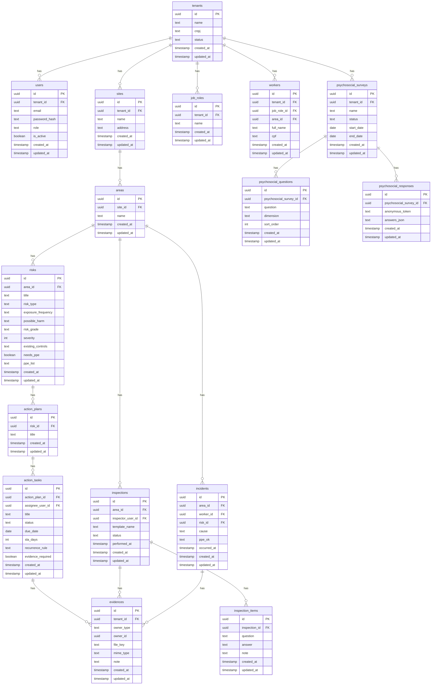

# PRD — Esfera NR1 (GRO/PGR + eSocial) — v0.1
_Data: 2026-01-31_  
_Status: manual (base para produto e desenvolvimento)_

---

## 1. Visão geral

O **Esfera NR1** é um SaaS de SST para **NR-1 (GRO/PGR)** que transforma o PGR em **rotina operacional diária**, com **trilha de evidências auditável**, e prepara a empresa para **eSocial SST** (fase 2).

**Tese de produto (bem objetiva):**  
> **“Transformar o PGR em operação diária — com evidência — e não em documento anual.”**

### 1.1 Problema que o Esfera NR1 resolve
- PGR “feito 1x por ano” (com planilha/PDF) não muda a operação do dia a dia.
- Ações corretivas ficam sem dono, sem SLA e sem prova.
- Campo tem baixa adesão (inspeções e registros viram burocracia).
- Psicossociais são difíceis de governar sem expor indivíduos.
- Integração eSocial costuma depender de retrabalho e “tradução” de dados.

### 1.2 Como desenhar para buscar liderança em 24 meses
**Estratégia:** vencer por **operação + evidência + mobile**, não por “documentos bonitos”.

**Wedge (entrada para dominar):**
1) **Motor de Plano de Ação**: tarefas recorrentes, responsáveis, SLA, auditoria, trilha de evidências.  
2) **Mobile-first de campo**: inspeções, quase-acidentes, EPI, QR codes, offline, upload assíncrono.  
3) **Psicossociais governados**: checklists/diagnósticos + plano de ação + proteção de anonimato + indicadores.

**Moats (difíceis de copiar):**
- **Evidência por padrão** (encerramento condicionado a prova, quando configurado).
- **Rotina “day-2 ready”** (tudo vira fila: pendências, SLAs, recorrências).
- **Offline resiliente** (fila local + sync + retry + resolução de conflitos).
- **Privacidade de psicossociais** (anonimização, agregação, limites mínimos).
- **Templates + importação + playbook** (implantação em dias, não meses).
- **Rastreabilidade total** (auditoria e histórico de decisão: quem alterou o quê e quando).

### 1.3 Concorrência (alto nível)
- Suites SST amplas: SOC, SGG, Nexo, Senior  
- Campo/mobile e EPI: MOB e apps de inspeção/entrega

Posicionamento do Esfera NR1: **“PGR operacional” + “evidência auditável” + “campo offline” + “psicossocial governado”**.

---

## 2. Sobre o produto

### 2.1 O que é
Plataforma SaaS para operacionalizar o GRO/PGR:
- Inventário de riscos (perigos/fatores, exposição, avaliação, controles).
- Plano de ação e tarefas (SLA, recorrência, responsáveis).
- Evidências (fotos, PDFs, anexos) e trilha auditável.
- Inspeções e checklists (PWA mobile/offline).
- Incidentes e quase-acidentes.
- Psicossociais (diagnóstico + plano de ação + privacidade).
- Dashboards e relatórios.
- Exportações e base para eSocial (fase 2).

### 2.2 O que NÃO é (escopo enxuto)
- Não é uma “suíte completa” de SST no v1 (sem testes/Docker no início).
- Não transmite eSocial diretamente no v1 (começa com export assistido/pacotes).
- Não substitui o julgamento técnico (o sistema guia e organiza evidências e ações).

### 2.3 Guardrails do projeto (obrigatórios)
- Backend: APIs REST em Node.js + Fastify.
- Frontend: Next.js + TailwindCSS.
- JWT, login por e-mail.
- SaaS multi-tenant por empresa.
- PostgreSQL apenas.
- Código em inglês, UI em PT-BR, preferir aspas simples.
- Todas as tabelas: `created_at`, `updated_at`.
- Docker e testes: apenas sprints finais.
- Site público + login/cadastro.
- Após login: redirecionar para dashboard principal.
- Estrutura de diretórios: frontend “espelha” módulos do backend.

---

## 3. Propósito
- Garantir que o GRO/PGR seja **processo contínuo**, não documento anual.
- Tornar o PGR **executável** (tarefas + SLA + evidências).
- Facilitar governança e tomada de decisão (dashboards e trilha).
- Reduzir retrabalho e risco regulatório (consistência e prova).
- Preparar dados para eSocial SST (S-2240 como prioridade).

---

## 4. Público alvo

### 4.1 Público primário
Empresas com operação distribuída e necessidade real de governança:
- Construção civil, indústria, logística, facilities e terceirizações.
- Empresas com SESMT interno ou consultoria recorrente.
- Ambientes com auditoria (clientes, seguradoras, certificações).

### 4.2 Papéis (início)
- Administrador do SaaS
- Administrador da Empresa

*(papéis detalhados e permissões entram depois, conforme diretriz do projeto)*

### 4.3 Personas de uso (para stories e UX)
- Técnico/Engenheiro de SST (opera inventário + ação + inspeção)
- Gestor de área (recebe tarefas, valida evidências)
- Trabalhador/inspector (mobile: checklist, foto, reporte)
- RH/DP (fase 2: export eSocial / integração)

---

## 5. Objetivos

### 5.1 Objetivos do produto (0–12 meses)
- Go-live em até 7 dias (inventário básico + motor de ação rodando).
- 80% das tarefas concluídas com evidência nas contas maduras.
- Operação de inspeção offline estável e rápida (execução < 3 minutos por checklist padrão).

### 5.2 Objetivos de liderança (12–24 meses)
- Ser referência em “PGR operacional + evidência + mobile” nos segmentos-alvo.
- Criar playbook de implantação replicável (templates + importador).
- Consolidar diferenciais psicossociais + offline como marca registrada.

---

## 6. Requisitos funcionais

### 6.1 Site público
- Home pública:
  - “o que é”, benefícios, segmentos, cadastre-se e login.
  - CTA focado em “PGR operacional”.

### 6.2 Autenticação e acesso (JWT)
- Cadastro com e-mail, senha, nome e empresa.
- Login por e-mail.
- Refresh token.
- Logout.
- Recuperação de senha (fase 2).

### 6.3 Multi-tenant (empresa)
- Cada usuário pertence a um tenant (empresa).
- Admin SaaS vê todas as empresas.
- Admin Empresa vê apenas sua empresa.
- Separação lógica por tenant em todas as consultas e arquivos.

### 6.4 Cadastro organizacional
- Unidades/locais (obra/filial/planta).
- Áreas/setores por unidade.
- Cargos/funções.
- Trabalhadores (mínimo viável: nome, área, cargo; cpf opcional).

### 6.5 Inventário de riscos (núcleo)
- Criar/editar/excluir riscos por área.
- Campos mínimos (v1):
  - Título/risco, tipo, frequência de exposição, possíveis danos,
  - graduação/classificação, severidade (escala), controles existentes,
  - necessidade de EPI + lista.
- Filtros e busca: por unidade/área/tipo/status.
- Export básico: CSV/PDF.

### 6.6 Motor de Plano de Ação
- Cada risco pode ter:
  - Plano de ação (container).
  - Tarefas (itens).
- Tarefa:
  - título, responsável, due date, SLA (dias),
  - recorrência (RRULE simplificado),
  - status, checklist, evidência obrigatória,
  - validação/aprovação (opcional, por admin).
- Auditoria:
  - histórico de status, comentários, anexos.

### 6.7 Evidências (trilha auditável)
- Upload de anexos.
- Evidência vinculada a: tarefa, inspeção, incidente.
- Logs: quem enviou, quando, de onde (opcional).
- Repositório com filtros por tipo e período.

### 6.8 Inspeções e checklists
- Templates de checklist (v1: json).
- Execução:
  - respostas, fotos, observações.
- Não conformidade:
  - criar tarefa automaticamente (configurável).
- QR code:
  - QR por área (v1),
  - QR por equipamento (fase 2).

### 6.9 Incidentes e quase-acidentes
- Registro rápido com evidência.
- Campos: data/hora, área, descrição, risco relacionado, causa, EPI adequado.
- Opcional: gerar tarefa corretiva.

### 6.10 Psicossociais governados
- Criar campanha/diagnóstico por unidade/área.
- Questionários por dimensão.
- Respostas anônimas.
- Relatórios agregados (sem identificação).
- Plano de ação derivado (tarefas).

### 6.11 Dashboards
- KPIs por empresa/unidade:
  - riscos por tipo/área,
  - tarefas por status/SLA,
  - inspeções realizadas vs pendentes,
  - incidentes por período/área.
- Drill-down para listas.

### 6.12 Importador (planilha)
- Upload + preview + validação.
- Importar:
  - áreas, cargos, trabalhadores, riscos (PPRA), acidentes (C-A), agenda de exames (PCMSO — futuro).
- Logs de import (linhas com erro, relatório).

#### 6.12.1 Extrações reais da planilha anexada (insumos primários)
**Áreas:** Financeiro, Operações, Jurídico, Logística, Todas  
**Cargos (amostra):** Analista Jr., Analista Pleno, Analista Sênior, Operador Jr., Operador Pleno, Operador Sênior, Gerente de Operações, Gerente Executivo, Diretor de Operações, Diretor Executivo  
**Funcionários (amostra):** Carlos Henrique, Matheus Pereira, Rodrigo Machado, Carolina Torres, Bianca Silva, Caio Souza  

**Riscos (amostra):** Vazamento de Gases, Risco de Incêndio, Infecção bacteriana, Ruídos, Alto ritmo de trabalho, Postura inadequada, Escorregamento e deslizamentos  
**Riscos por tipo (PPRA):** {'Biológico': 1, 'Físico': 2, 'Outro': 3, 'Químico': 1}  
**Riscos por área (PPRA):** {'Financeiro': 1, 'Jurídico': 1, 'Logística': 2, 'Operações': 3}  

**Agenda PCMSO (amostra / uso futuro):**
- Exame de Sangue | Área: Operações | Cargo: Todos | Freq: Semanalmente
- Exame de MAPA | Área: Financeiro | Cargo: Todos | Freq: Mensalmente
- Ultrassonografia | Área: Operações | Cargo: Operador Jr. | Freq: Quinzenalmente
- Radiografia | Área: Jurídico | Cargo: Operador Sênior | Freq: Mensalmente

**Controle de acidentes (amostra / aba C-A):**
- 2017-07-07 | Risco:  | Área:  | Causa:  | EPI adequado: 
- 2017-07-08 | Risco:  | Área:  | Causa:  | EPI adequado: 
- 2017-07-09 | Risco:  | Área:  | Causa:  | EPI adequado: 
- 2017-07-10 | Risco:  | Área:  | Causa:  | EPI adequado: 

### 6.13 Integração eSocial (fase 2)
- Export assistido/pacote de dados para:
  - S-2240 (prioridade)
  - futuros eventos SST
- Tela de validação + log de export.

---

### 6.14 Flowchart mermaid (UX)

```mermaid
flowchart TD
  A[Site público] --> B[Cadastre-se]
  A --> C[Login]
  B --> D[Onboarding: criar empresa]
  D --> E[Configurar unidades e áreas]
  E --> F[Importar planilha OU cadastrar manual]
  F --> G[Dashboard]
  G --> H[Inventário de riscos]
  H --> I[Plano de ação]
  I --> J[Tarefas + SLA + recorrência]
  J --> K[Evidências]
  G --> L[Inspeções (PWA)]
  L --> J
  G --> M[Incidentes / Quase-acidentes]
  M --> J
  G --> N[Psicossociais]
  N --> I
  G --> O[Relatórios / Exportações]
  O --> P[eSocial (fase 2)]
```

```mermaid
flowchart TD
  A[Mobile (PWA)] --> B[Selecionar unidade/área]
  B --> C[Escanear QR (opcional)]
  C --> D[Executar checklist]
  D --> E{Não conformidade?}
  E -- Sim --> F[Criar tarefa automática]
  E -- Não --> G[Concluir inspeção]
  F --> H[Anexar evidências]
  G --> H
  H --> I[Sincronizar quando online]
```

---

## 7. Requisitos não-funcionais
- Segurança: JWT, segregação por tenant, logs auditáveis.
- LGPD: minimização de dados, anonimato/aggregation em psicossociais.
- Offline: fila local (IndexedDB), sync, retry, limites de upload.
- Performance: páginas críticas < 2s; upload assíncrono.
- Observabilidade: logs estruturados + métricas básicas.

---

## 8. Arquitetura técnica

### 8.1 Stack
- Backend: Node.js + Fastify + TypeScript
- DB: PostgreSQL
- Front: Next.js + TailwindCSS
- Auth: JWT
- Storage: objeto (S3 compatível) ou local (dev)
- Jobs: fila simples (tabela/worker) para uploads assíncronos

### 8.2 Estrutura de dados (Mermaid)


---

## 9. Design system (Tailwind / Next.js)

### 9.1 Layout base (padrão para todas as telas)
- Sidebar fixa (navegação)
- Topbar com busca e seletor de unidade
- Conteúdo em cards (KPI, gráficos, tabelas)
- Grid responsivo (1 col mobile, 2–3 col desktop)

### 9.2 Cores (tokens)
- Fundo: `slate-50` / `sky-50`
- Card: `white`
- Primária: `teal-700` (hover `teal-800`)
- Texto: `slate-900` / `slate-600`
- Borda: `slate-200`
- Sucesso/alerta/perigo: `emerald-600` / `amber-500` / `red-600`

### 9.3 Componentes padrão
- Sidebar item: ativo com left border + bg suave
- KPI card: número grande, label pequena, badge de delta
- Table: filtros por coluna, paginação
- Form: cards com seções, validação inline
- Buttons: primary/secondary/danger
- Badges: status de tarefa e SLA

---

## 10. User stories

### Épico A — Onboarding e estrutura
- Como admin empresa, quero criar unidade/área/cargos e usuários para iniciar o PGR.
- Critérios de aceite:
  - CRUDs completos, validações, filtros e UI consistente.

### Épico B — Inventário de riscos
- Como SESMT, quero cadastrar e classificar riscos por área para manter inventário vivo.
- Critérios de aceite:
  - cadastro rápido, export, filtros e histórico.

### Épico C — Plano de ação e evidência
- Como gestor, quero receber tarefas com SLA e anexar evidências para provar execução.
- Critérios de aceite:
  - recorrência, vencidos, auditoria e galeria de evidências.

### Épico D — Campo (inspeções + offline + QR)
- Como inspector, quero executar checklists offline e sincronizar depois.
- Critérios de aceite:
  - PWA instalável, fila offline e sync confiável.

### Épico E — Incidentes / quase-acidentes
- Como SESMT, quero registrar incidentes e gerar ações corretivas.
- Critérios de aceite:
  - criação em <2min e relatórios básicos.

### Épico F — Psicossociais
- Como admin, quero aplicar diagnóstico anônimo e gerar plano de ação.
- Critérios de aceite:
  - anonimato real e relatórios agregados.

### Épico G — eSocial (fase 2)
- Como RH/DP, quero exportar dados S-2240 para reduzir retrabalho.
- Critérios de aceite:
  - export validado + log de erros.

---

## 11. Métricas de sucesso
- Ativação (48h): 1 unidade, 1 área, 1 risco, 3 ações.
- Adoção: WAU de inspectors; tarefas semanais.
- Eficiência: tempo médio de encerramento.
- Evidência: % com prova.
- Retenção: 8 semanas seguidas de uso.

---

## 12. Risco e mitigações
- Regulação muda → regras configuráveis + atualização de templates.
- Campo não usa → mobile first + QR + fluxo curto.
- Psicossocial sensível → anonimato + limites.
- Offline falha → fila local + sync robusto.
- Concorrentes suite → posicionamento em operação/evidência.

---

## 13. Lista de tarefas (em sprints)

> Sprints de 2 semanas. Granularidade alta para execução com IA (Codex/agents).

### Sprint 0 — Fundamentos
- [ ] Monorepo `backend/` e `frontend/`
  - [ ] Padronizar lint/format (single quotes)
  - [ ] Scripts dev/build
- [ ] Backend bootstrap
  - [ ] Fastify app + plugins (cors, helmet, rate limit)
  - [ ] Handler padrão de erros
  - [ ] Healthcheck `/health`
- [ ] Frontend bootstrap
  - [ ] Next.js + Tailwind + layout base
  - [ ] Componentes: Sidebar, Topbar, Card, Table, FormSection, Button
- [ ] Banco
  - [ ] Conexão Postgres
  - [ ] Migrações base (tenants, users) com timestamps

### Sprint 1 — Auth + Tenant
- [ ] Backend auth
  - [ ] `POST /auth/register` (cria tenant + user admin)
  - [ ] `POST /auth/login` (JWT access/refresh)
  - [ ] `POST /auth/refresh`
  - [ ] Password policy + hash
- [ ] Middleware
  - [ ] Guard JWT
  - [ ] Contexto com `tenant_id`
- [ ] Front
  - [ ] Home pública
  - [ ] Login (PT-BR)
  - [ ] Cadastro (empresa + admin)
  - [ ] Redirect pós-login para Dashboard

### Sprint 2 — Cadastros organizacionais
- [ ] Backend models + rotas
  - [ ] Sites, Areas, JobRoles, Workers
  - [ ] Validar tenant em todas as rotas
- [ ] Front telas
  - [ ] Unidades: list + create/edit
  - [ ] Áreas: list + create/edit
  - [ ] Cargos: list + create/edit
  - [ ] Trabalhadores: list + create/edit
- [ ] UX
  - [ ] Seletor de unidade no topo
  - [ ] Breadcrumb simples

### Sprint 3 — Importador v1 (planilha)
- [ ] Backend
  - [ ] Endpoint upload
  - [ ] Parser (CAD_AREA, CAD_CARGO, CAD_FUNC)
  - [ ] Preview + validação
- [ ] Front
  - [ ] Tela “Importar planilha”
  - [ ] Preview com contagem + erros por linha
  - [ ] Confirmar import (commit)

### Sprint 4 — Inventário de riscos
- [ ] Backend
  - [ ] Model Risk + migração
  - [ ] CRUD + filtros
  - [ ] Regras: severidade range, tipo enumerado
- [ ] Front
  - [ ] Lista (table + filtros)
  - [ ] Form (validações e helpers)
- [ ] Import PPRA
  - [ ] Parser PPRA -> Risk
  - [ ] Mapear “Tipo de Risco” para enum interno

### Sprint 5 — Plano de ação + tarefas
- [ ] Backend
  - [ ] Models ActionPlan + ActionTask
  - [ ] Regras de SLA, due_date, status
  - [ ] Recorrência (RRULE simplificado)
  - [ ] Auditoria (history/status log)
- [ ] Front
  - [ ] Kanban/board simples
  - [ ] Detalhe da tarefa
  - [ ] Criar tarefa a partir do risco

### Sprint 6 — Evidências
- [ ] Backend
  - [ ] Model Evidence (owner_type/owner_id)
  - [ ] Upload (local dev) + metadata
  - [ ] Lista por owner
- [ ] Front
  - [ ] Componente upload
  - [ ] Galeria com filtros (tipo/período)

### Sprint 7 — Inspeções e checklists
- [ ] Backend
  - [ ] Models Inspection + InspectionItem
  - [ ] Templates (json) por tenant
  - [ ] Regra: item “não conforme” gera tarefa (flag)
- [ ] Front
  - [ ] Criar template
  - [ ] Executar checklist (desktop)

### Sprint 8 — PWA + offline
- [ ] Front (PWA)
  - [ ] Manifest + install
  - [ ] IndexedDB queue
  - [ ] Sync service (retry/backoff)
  - [ ] UI offline indicators
- [ ] Backend
  - [ ] Endpoints idempotentes para sync

### Sprint 9 — Incidentes / quase-acidentes
- [ ] Backend
  - [ ] Model Incident
  - [ ] CRUD + endpoint rápido
  - [ ] Import C-A -> Incident (opcional)
- [ ] Front
  - [ ] Form rápido (mobile-friendly)
  - [ ] Lista + filtros

### Sprint 10 — Dashboards
- [ ] Backend
  - [ ] Endpoints agregados (KPIs)
- [ ] Front
  - [ ] Dashboard principal (cards + gráficos em cards)

### Sprint 11 — Psicossociais v1
- [ ] Backend
  - [ ] Survey, Questions, Responses
  - [ ] Token anônimo + limites mínimos por recorte
  - [ ] Relatório agregado + geração de tarefas
- [ ] Front
  - [ ] Criar campanha
  - [ ] Página de resposta anônima
  - [ ] Dashboard agregado

### Sprint 12 — Exportações + eSocial base
- [ ] Export v1
  - [ ] PDF/CSV inventário
  - [ ] PDF/CSV plano de ação
- [ ] eSocial base (fase 2)
  - [ ] Mapping risco -> fatores (S-2240)
  - [ ] Export assistido + log de erros

### Sprints finais — Docker e Testes
- [ ] Docker (backend/frontend/postgres)
- [ ] Testes mínimos (auth, risks, tasks, imports)
- [ ] CI básico

---

## Referências (para o time)
```text
NR-01 (PDF, gov.br): https://www.gov.br/trabalho-e-emprego/pt-br/acesso-a-informacao/participacao-social/conselhos-e-orgaos-colegiados/comissao-tripartite-partitaria-permanente/normas-regulamentadora/normas-regulamentadoras-vigentes/nr-01-atualizada-2025-i-1.pdf
Portaria MTE nº 1.419/2024 (PDF, gov.br): https://www.gov.br/trabalho-e-emprego/pt-br/assuntos/inspecao-do-trabalho/seguranca-e-saude-no-trabalho/sst-portarias/2024/portaria-mte-no-1-419-nr-01-gro-nova-redacao.pdf/view
Documentação Técnica eSocial (gov.br): https://www.gov.br/esocial/pt-br/documentacao-tecnica
Leiaute S-2240 (gov.br): https://www.gov.br/esocial/pt-br/documentacao-tecnica/leiautes-esocial-v-1-3/evtcdbenalt_2240_v_s_01_03_00.xhtml
Manual eSocial S-1.3 (PDF, gov.br): https://www.gov.br/esocial/pt-br/documentacao-tecnica/manuais/mos-s-1-3-consolidada-ate-a-no-s-1-3-07-2026.pdf
Top of Mind Proteção 2025: https://protecao.com.br/top-of-mind/top-of-mind-de-protecao-2025-vencedores/
```
