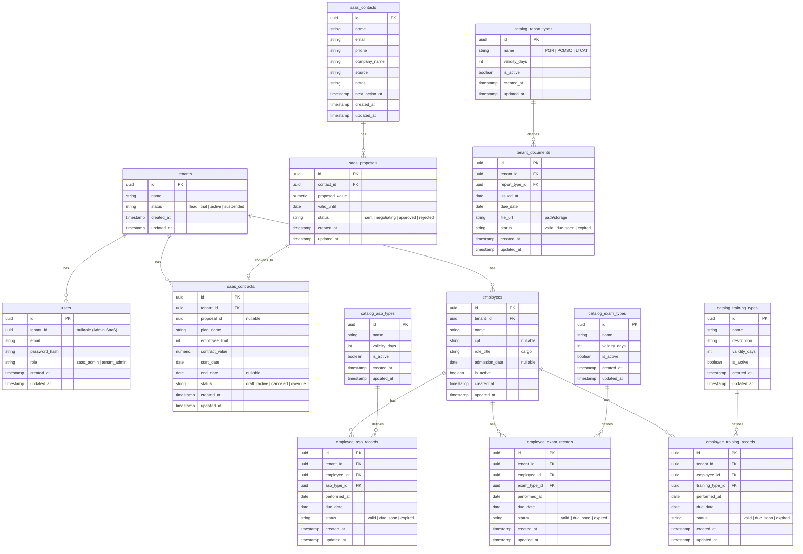

# PRD — SaaS de Controle de Vencimentos (ASO, Exames, Laudos e Treinamentos)

> **Objetivo central do produto:** controlar **datas de vencimento** (validade) e gerar **alertas acionáveis** para evitar pendências (ex.: ASO vencido, treinamento vencido, laudo vencido).

---

## 1) Visão geral

Este documento descreve o Product Requirement Document (PRD) de um **SaaS multiempresa (multi-tenant)** com dois ambientes principais:

1. **Dashboard do Administrador do SaaS (Backoffice)**: gestão do ciclo de vida do SaaS — clientes, contratos, valores e um CRM simples (Contato → Proposta → Contrato), além do cadastro de **tipos globais** (ASO, exames, laudos e treinamentos) com suas **valididades**.
2. **Dashboard do Cliente (Empresa)**: após login, o cliente cadastra funcionários e registra eventos (ASO, exames, treinamentos) e documentos (PGR, PCMSO, LTCAT), com cálculo de vencimento e alertas.

O MVP deve ser **simples e enxuto**, focado em:
- cadastro de catálogos globais de validade (feito pelo Administrador do SaaS);
- cadastro de funcionários e eventos (feito pelo Cliente);
- cálculo de vencimentos e alertas;
- comparação de **quantidade de funcionários cadastrados** vs **montante contratado** (limite do contrato).

---

## 2) Sobre o produto

### 2.1 Nome de trabalho
**Esfera NR1 — Vencimentos** (nome provisório).

### 2.2 Problema a resolver
Empresas perdem prazos e ficam com pendências de SST por falta de controle sistemático e alertas. O produto organiza itens por funcionário e por empresa, calcula vencimentos automaticamente e mostra o que está:
- **Válido**
- **A vencer** (ex.: dentro de 30/60/90 dias)
- **Vencido**

### 2.3 Escopo do MVP
- Controle de validade de:
  - **ASO** (tipos e registros por funcionário);
  - **Exames** (tipos e registros por funcionário);
  - **Laudos/Documentos** (PGR, PCMSO, LTCAT) por empresa;
  - **Treinamentos** (tipos e registros por funcionário).
- Alertas na interface com **sininho** (contador de pendências).
- Backoffice do SaaS para **clientes, contratos e CRM simples**.
- Cadastro global de “Tipos e Validades” (catálogos) pelo Admin do SaaS.

### 2.4 Não-objetivos (fora do MVP)
- Integração com eSocial (manter como roadmap).
- Múltiplos papéis detalhados por empresa (manter como roadmap; apenas Admin da Empresa no MVP).
- Automação por WhatsApp/e-mail no MVP (deixar preparado, mas opcional para sprint final).

---

## 3) Propósito

Entregar um sistema SaaS que permita:
- padronizar cadastros de “tipos” (ASO/exames/laudos/treinamentos) com validade;
- registrar a execução por funcionário/empresa;
- calcular o vencimento automaticamente;
- gerar alertas claros e priorizados;
- apoiar a gestão do contrato (limite de funcionários vs contratado) para o “Gestor de ASO”.

---

## 4) Público alvo

### 4.1 Usuários do Administrador do SaaS
- Operação comercial/administrativa do SaaS.
- Responsável por contratos e pipeline (contato → proposta → contrato).
- Responsável por cadastrar tipos globais e validade padrão.

### 4.2 Usuários do Cliente (Empresa)
- Administrador da empresa (SST/RH/DP/Clínica parceira).
- Precisa acompanhar vencimentos de ASO, exames, treinamentos e documentos legais.

---

## 5) Objetivos

1. **Reduzir vencimentos não monitorados** por meio de alertas e visão consolidada.
2. **Padronizar catálogos** (tipos e validade) para todos os clientes.
3. **Dar visibilidade operacional** para o cliente: pendências por categoria e por funcionário.
4. **Dar visibilidade comercial** para o SaaS: contratos, valores e funil simples.
5. **Relacionar uso vs contrato**: número de funcionários cadastrados vs limite contratado.

---

## 6) Requisitos funcionais

### 6.1 Autenticação e Acesso (com JWT)
- Login por **e-mail** (não usar username).
- 2 perfis (MVP):
  - **Administrador do SaaS** (acesso global).
  - **Administrador da Empresa** (acesso restrito ao tenant/empresa).
- Redirecionamento pós-login:
  - Admin SaaS → `/admin/dashboard`
  - Admin Empresa → `/app/dashboard`

### 6.2 Site público (marketing)
- Página pública com:
  - Apresentação do produto.
  - Botões: **Cadastre-se** e **Login**.
- Cadastro (cadastre-se):
  - cria uma **empresa (tenant)** e um usuário Admin da Empresa, ou cria um “lead” no CRM do SaaS (decisão de implementação: no MVP, criar empresa + admin, porém marcar como “trial” até contrato).

### 6.3 Backoffice — Administrador do SaaS (ciclo de vida do SaaS)

#### 6.3.1 Gestão de Clientes (Empresas/Tenants)
- CRUD de empresas:
  - Razão social / nome fantasia
  - CNPJ (opcional no MVP)
  - Segmento (opcional)
  - Status (lead / trial / ativo / suspenso)
- Visualizar métricas por cliente:
  - Funcionários cadastrados
  - Limite contratado
  - Itens vencidos / a vencer (contagem)

#### 6.3.2 Contratos (assinatura/contratação)
- CRUD de contratos por cliente:
  - Plano (nome)
  - Quantidade contratada (limite de funcionários) — **campo obrigatório**
  - Valor mensal/anual
  - Data de início
  - Data de término (opcional)
  - Status (rascunho / ativo / cancelado / inadimplente)
- Regras MVP:
  - O sistema deve calcular e exibir **% de uso do contrato** (funcionários cadastrados ÷ limite contratado).
  - Se exceder o limite, exibir aviso (não bloquear no MVP; apenas alertar).

#### 6.3.3 CRM simples (Contato → Proposta → Contrato)
- **Contato (Lead)**:
  - Nome, e-mail, telefone, empresa, origem
  - Observações
  - Próxima ação (data opcional)
- **Proposta**:
  - vinculada ao contato
  - valor proposto
  - validade da proposta (data)
  - status (enviada / em negociação / aprovada / rejeitada)
- **Contrato**:
  - gerado a partir de proposta aprovada (ou criado manualmente)
  - vinculado ao cliente

#### 6.3.4 Catálogos Globais de Tipos e Validades (Admin do SaaS)
> Estes cadastros são **globais** e valem para todos os clientes.

- **Tipos de Treinamento**:
  - nome
  - descrição curta
  - validade (em dias ou meses) — obrigatório
  - ativo/inativo
- **Tipos de ASO**:
  - nome (ex.: Admissional, Periódico, Retorno ao Trabalho, Mudança de Função, Demissional)
  - validade (dias/meses) — obrigatório
  - ativo/inativo
- **Tipos de Exames**:
  - nome (ex.: Audiometria, Espirometria, Exame clínico, etc.)
  - validade (dias/meses) — obrigatório
  - ativo/inativo
- **Tipos de Laudos/Documentos**:
  - nome (PGR, PCMSO, LTCAT)
  - validade (dias/meses) — obrigatório
  - ativo/inativo

#### 6.3.5 Configurações de Alertas (globais)
- Definir “janela de aviso” (padrão):
  - **90 dias**, **60 dias**, **30 dias**
- Definir prioridade:
  - vencido = alta
  - a vencer em 0–30 = alta
  - a vencer em 31–60 = média
  - a vencer em 61–90 = baixa

### 6.4 App do Cliente — Administrador da Empresa

#### 6.4.1 Dashboard do Cliente
- Cards principais:
  - Funcionários cadastrados (total)
  - Limite contratado
  - % de uso
  - Itens vencidos (total)
  - Itens a vencer em 30 dias (total)
- Lista “Alertas prioritários”:
  - agrupado por categoria (ASO, exame, treinamento, laudo)
  - com filtros por prazo (vencidos / 30 / 60 / 90)

#### 6.4.2 Sininho de alertas (UI)
- Ícone no topo com contador (badge).
- Clique abre painel/lista de alertas.
- Ações:
  - marcar como lido (client-side e/ou persistido)
  - “ver detalhes” → navega para a tela do item (funcionário ou documento)

#### 6.4.3 Cadastro de Funcionários
- CRUD de funcionários:
  - Nome
  - CPF (opcional no MVP)
  - Matrícula (opcional)
  - Cargo (texto simples no MVP)
  - Data de admissão (opcional)
  - Ativo/inativo

#### 6.4.4 Registro de ASO por Funcionário
- Selecionar funcionário
- Selecionar tipo de ASO (catálogo global)
- Informar data de realização
- O sistema calcula automaticamente:
  - data de vencimento = data de realização + validade do tipo
  - status (válido/a vencer/vencido)
- Tela deve permitir listar histórico por funcionário.

#### 6.4.5 Registro de Exames por Funcionário
- Selecionar funcionário
- Selecionar tipo de exame (catálogo global)
- Informar data de realização
- O sistema calcula vencimento e status.

#### 6.4.6 Registro de Treinamentos por Funcionário
- Selecionar funcionário
- Selecionar tipo de treinamento (catálogo global)
- Informar data de realização
- O sistema calcula vencimento e status.

#### 6.4.7 Laudos/Documentos da Empresa (PGR, PCMSO, LTCAT)
- Selecionar tipo (catálogo global)
- Informar data de emissão/realização
- Upload do arquivo (PDF ou imagem) — MVP aceita somente PDF.
- O sistema calcula vencimento e status.
- Tela deve listar “Documentos da empresa” por tipo e status.

### 6.5 Motor de Vencimentos (cálculo central)
- Para cada registro (ASO, exame, treinamento, laudo), o sistema deve gerar:
  - `due_date` (data de vencimento)
  - `status` (valid / due_soon / expired)
  - `days_to_due` (dias para vencer; negativo se vencido)
- Regras:
  - validade pode ser em **dias** (inteiro) no banco para simplificar.
  - catálogo global define `validity_days`.
  - cálculo usa timezone da empresa (Brasil) para consistência.

### 6.6 Fluxos de UX (Mermaid)

```mermaid
flowchart TD
  A[Site público] --> B[Cadastre-se]
  A --> C[Login]
  B --> D[Criar Empresa (Tenant)]
  D --> E[Criar usuário Admin da Empresa]
  C --> F{Perfil do usuário}
  F -->|Admin SaaS| G[/admin/dashboard]
  F -->|Admin Empresa| H[/app/dashboard]

  subgraph SaaS_Admin[Backoffice - Admin SaaS]
    G --> G1[Clientes]
    G --> G2[CRM: Contatos]
    G2 --> G3[CRM: Propostas]
    G3 --> G4[Contratos]
    G --> G5[Catálogos globais]
    G5 --> G6[Tipos: ASO / Exames / Treinamentos / Laudos]
    G --> G7[Config. de alertas]
  end

  subgraph Cliente_App[App do Cliente - Admin Empresa]
    H --> H1[Funcionários]
    H --> H2[ASO por funcionário]
    H --> H3[Exames por funcionário]
    H --> H4[Treinamentos por funcionário]
    H --> H5[Laudos da empresa]
    H --> H6[Sininho: Alertas]
    H6 --> H7[Detalhe do item]
  end
```

---

## 7) Requisitos não-funcionais

### 7.1 Tecnologia e padrões
- Backend: Node.js + TypeScript + Fastify (API REST).
- Frontend: Next.js + TypeScript + TailwindCSS (layout responsivo).
- Banco: PostgreSQL (único banco).
- Autenticação: JWT (login por e-mail).

### 7.2 Padrões de código e idioma
- Código-fonte e nomes técnicos em **inglês** (models, routes, services).
- Interface do usuário **100% em pt-BR**.
- Preferência por **aspas simples** no código sempre que possível (enforce via ESLint/Prettier).

### 7.3 Multi-tenant
- Toda entidade “do cliente” deve ter `tenant_id` e ser filtrada por tenant no backend.
- Admin SaaS pode acessar dados agregados, mas não deve editar registros operacionais de clientes no MVP (apenas visualizar métricas).

### 7.4 Performance
- Dashboard do cliente deve carregar em < 2s com até:
  - 2.000 funcionários
  - 20.000 registros (ASO/exames/treinamentos) no total
- Indexação mínima obrigatória:
  - `tenant_id`
  - `due_date`
  - `employee_id` (quando existir)

### 7.5 Segurança
- JWT com expiração e renovação (recomendado refresh token via cookie httpOnly).
- Logs de auditoria simples (MVP):
  - quem criou/alterou um registro (user_id).
- LGPD:
  - limitar dados pessoais no MVP (CPF opcional).

### 7.6 Restrições do MVP (conforme pedido)
- **Não implementar Docker inicialmente** (planejar para sprints finais).
- **Não implementar testes inicialmente** (planejar para sprints finais).

---

## 8) Arquitetura técnica

### 8.1 Stack
**Backend**
- Node.js
- Fastify
- TypeScript
- ORM: Drizzle ORM (ou equivalente) com migrations
- PostgreSQL
- JWT

**Frontend**
- Next.js (App Router)
- TypeScript
- TailwindCSS

**Infra (MVP)**
- Deploy backend e frontend em ambientes separados (ou monorepo com builds separados).
- Storage de arquivos (upload de PDF):
  - MVP: storage local no servidor (com caminho persistente)
  - Roadmap: storage S3-compatible

### 8.2 Estrutura de pastas (sugestão simples e modular)
- `apps/api` (Fastify)
- `apps/web` (Next.js)
- `packages/shared` (tipos, validações, helpers)

> Cada “módulo” do web deve espelhar os domínios do backend (ex.: `contracts`, `catalog`, `employees`, `alerts`).

### 8.3 Estrutura de dados (schemas em Mermaid)



---

## 9) Design system

> **Padrão visual:** moderno, responsivo, consistente em todas as telas. Implementação com TailwindCSS.

### 9.1 Tokens (cores sugeridas)
- `--brand-red`: `#74292c`
- `--brand-sand`: `#d7d0c9`
- `--bg`: `#ffffff`
- `--text`: `#171717`
- Estados:
  - Sucesso/OK: usar classes Tailwind padrão (sem definir paleta custom no MVP)
  - Atenção: destaque com borda e badge
  - Erro/vencido: badge forte + ícone

### 9.2 Componentes base (Tailwind)
- **Layout**
  - Sidebar (app) + Topbar (com sininho) + Content
  - Grid responsivo (`grid`, `gap-4`, `md:grid-cols-2`, `lg:grid-cols-4`)
- **Cards**
  - `rounded-2xl`, `shadow-sm`, `border`, `p-4`
- **Botões**
  - Primário (brand red): fundo `brand-red`, texto branco, hover invertendo (fundo branco, texto `brand-red`, borda `brand-red`)
- **Inputs/Forms**
  - `border`, `rounded-lg`, `focus:ring`, `focus:border`
- **Badges**
  - “Vencido”, “A vencer”, “Válido” com variações de `bg` e `text`
- **Tabela**
  - Cabeçalho fixo no desktop (opcional), zebra leve (opcional)
- **Alert drawer (sininho)**
  - painel lateral com lista e filtros

### 9.3 Padrões de UX
- Sempre mostrar “Resumo” no topo das telas (contadores).
- “Ações rápidas” (ex.: cadastrar funcionário, registrar ASO) no dashboard do cliente.
- Erros de validação sempre abaixo do campo, em pt-BR.

---

## 10) User stories

### Épico A — Autenticação e Multiempresa
- **US-A1**: Como usuário, quero fazer login com meu e-mail e senha para acessar meu dashboard.
  - **Aceite**
    - [ ] Login aceita e-mail/senha válidos e retorna JWT.
    - [ ] Usuário Admin SaaS é redirecionado para `/admin/dashboard`.
    - [ ] Usuário Admin Empresa é redirecionado para `/app/dashboard`.
    - [ ] Usuário não autenticado não acessa rotas protegidas.

### Épico B — Catálogos Globais (Admin SaaS)
- **US-B1**: Como Admin SaaS, quero cadastrar tipos de treinamento com validade para padronizar o sistema.
  - **Aceite**
    - [ ] Criar/editar/inativar tipo de treinamento.
    - [ ] Campo `validity_days` obrigatório e > 0.
- **US-B2**: Como Admin SaaS, quero cadastrar tipos de ASO/exames/laudos com validade.
  - **Aceite**
    - [ ] CRUD completo para cada catálogo.
    - [ ] Inativos não aparecem para novos lançamentos no cliente, mas mantêm histórico.

### Épico C — Funcionários e Registros (Cliente)
- **US-C1**: Como Admin Empresa, quero cadastrar funcionários para controlar seus vencimentos.
  - **Aceite**
    - [ ] CRUD de funcionário.
    - [ ] Contador de funcionários aparece no dashboard.
- **US-C2**: Como Admin Empresa, quero registrar ASO/exames/treinamentos e ver vencimentos automáticos.
  - **Aceite**
    - [ ] Ao salvar registro, sistema calcula `due_date` e `status`.
    - [ ] Listagem mostra status e dias restantes.
- **US-C3**: Como Admin Empresa, quero anexar laudos (PGR/PCMSO/LTCAT) e acompanhar vencimentos.
  - **Aceite**
    - [ ] Upload de PDF e criação do registro com vencimento.
    - [ ] Listagem por tipo e status.

### Épico D — Alertas e Sininho
- **US-D1**: Como Admin Empresa, quero ver um sininho com pendências para agir rapidamente.
  - **Aceite**
    - [ ] Sininho mostra contagem de itens “vencidos” + “a vencer em 30 dias” (padrão).
    - [ ] Ao clicar, abre lista com filtro (vencidos/30/60/90).
    - [ ] Ao clicar em item, navega para detalhe.

### Épico E — Contratos e Uso vs Limite (Admin SaaS e Cliente)
- **US-E1**: Como Admin SaaS, quero definir limite contratado por cliente para medir uso.
  - **Aceite**
    - [ ] Contrato exige `employee_limit`.
    - [ ] Tela do cliente mostra total e % de uso.
- **US-E2**: Como Admin Empresa, quero ver se estou acima do contratado para ajustar o contrato.
  - **Aceite**
    - [ ] Exibir aviso quando `employees_count > employee_limit`.

---

## 11) Métricas de sucesso (KPIs)

### Produto (SaaS)
- # de empresas ativas
- Conversão do CRM: contato → proposta → contrato
- Taxa de churn (mensal)

### Uso (Cliente)
- % de empresas que cadastraram ao menos 1 funcionário (ativação)
- % de empresas com ao menos 1 registro (ASO/exame/treinamento/laudo) em 7 dias (engajamento)
- Tempo médio para registrar um evento (ASO/exame etc.)

### Qualidade do controle de vencimentos
- Itens vencidos por empresa (média)
- % de itens resolvidos antes do vencimento (tendência)
- Redução de vencidos ao longo do tempo (por empresa)

---

## 12) Riscos e mitigações

- **Risco:** dados de empresas se misturarem (falha multi-tenant).
  - **Mitigação:** obrigatoriedade de `tenant_id` + middleware de scoping no backend + testes de isolamento (sprint final).
- **Risco:** cálculo incorreto de vencimento por timezone/data.
  - **Mitigação:** padronizar cálculo em UTC e exibir em timezone BR; testes unitários de cálculo (sprint final).
- **Risco:** upload de documentos crescer e ficar caro/instável.
  - **Mitigação:** MVP com storage simples; roadmap para S3-compatible.
- **Risco:** catálogo global “engessa” clientes com necessidades diferentes.
  - **Mitigação:** roadmap para permitir override por tenant (fora do MVP).

---

## 13) Lista de tarefas (em sprints)

> Checklists em tarefas e subtarefas detalhadas. Ajustar a duração de sprint conforme sua cadência (ex.: 1 ou 2 semanas).

### Sprint 0 — Setup e fundação do projeto
- [ ] Repositório e monorepo
  - [ ] Criar estrutura `apps/api`, `apps/web`, `packages/shared`
  - [ ] Configurar TypeScript em todos os pacotes
  - [ ] Configurar `.editorconfig`
- [ ] Qualidade de código (mínimo)
  - [ ] ESLint com regra de aspas simples
  - [ ] Prettier
  - [ ] Husky (opcional) para pre-commit (somente lint)
- [ ] Banco e migrations
  - [ ] Provisionar Postgres (ambiente dev)
  - [ ] Configurar Drizzle ORM (ou ORM escolhido)
  - [ ] Criar mecanismo de migrations
- [ ] Infra local
  - [ ] Variáveis `.env.example` (api e web)
  - [ ] Script de seed (catálogos vazios no início)
- [ ] Design base
  - [ ] Implementar layout base (Sidebar + Topbar + Content)
  - [ ] Definir tokens de cor (brand-red, brand-sand) no Tailwind

### Sprint 1 — Autenticação + Site público
- [ ] API: autenticação JWT
  - [ ] Endpoint `POST /auth/login` (email/senha)
  - [ ] Endpoint `POST /auth/register` (criar tenant + tenant_admin)
  - [ ] Hash de senha (argon2/bcrypt)
  - [ ] Middleware de auth + role guard (saas_admin vs tenant_admin)
- [ ] Web: páginas públicas
  - [ ] Home pública
  - [ ] Página de login
  - [ ] Página de cadastre-se
- [ ] Web: rotas protegidas
  - [ ] Guard de rotas (verificar token)
  - [ ] Redirecionamento por role
- [ ] Banco: tabelas base
  - [ ] `users`, `tenants`

### Sprint 2 — Backoffice SaaS: Clientes + Contratos
- [ ] Banco
  - [ ] `saas_contracts`
- [ ] API: contratos
  - [ ] CRUD de contratos por tenant
  - [ ] Regras: `employee_limit` obrigatório
- [ ] Web: telas SaaS Admin
  - [ ] Dashboard do SaaS (`/admin/dashboard`)
  - [ ] Clientes (`/admin/tenants`)
  - [ ] Contratos (`/admin/contracts`)
  - [ ] Card “uso do contrato” por cliente (funcionários vs limite) — placeholder até Sprint 4
- [ ] Permissões
  - [ ] Garantir que tenant_admin não acessa rotas `/admin/*`

### Sprint 3 — Backoffice SaaS: CRM simples + Catálogos globais
- [ ] Banco
  - [ ] `saas_contacts`, `saas_proposals`
  - [ ] `catalog_training_types`, `catalog_aso_types`, `catalog_exam_types`, `catalog_report_types`
- [ ] API: CRM
  - [ ] CRUD contatos
  - [ ] CRUD propostas
  - [ ] Ação: “aprovar proposta → gerar contrato”
- [ ] API: catálogos globais
  - [ ] CRUD tipos de treinamento (validity_days)
  - [ ] CRUD tipos de ASO (validity_days)
  - [ ] CRUD tipos de exames (validity_days)
  - [ ] CRUD tipos de laudos (validity_days)
- [ ] Web: telas CRM e catálogos
  - [ ] Contatos, Propostas, Contratos (workflow simples)
  - [ ] Catálogos globais (4 telas com padrão único)

### Sprint 4 — App do Cliente: Funcionários + Registros
- [ ] Banco
  - [ ] `employees`
  - [ ] `employee_aso_records`, `employee_exam_records`, `employee_training_records`
- [ ] API: funcionários
  - [ ] CRUD
  - [ ] Contagem por tenant (para “uso do contrato”)
- [ ] API: registros por funcionário
  - [ ] Criar ASO record (calcular due_date + status)
  - [ ] Criar exame record (calcular due_date + status)
  - [ ] Criar treinamento record (calcular due_date + status)
  - [ ] Listar por funcionário e por status
- [ ] Web: telas do cliente
  - [ ] Dashboard (`/app/dashboard`) com cards e listas (dados reais)
  - [ ] Funcionários listagem + cadastro/edição
  - [ ] Registro de ASO/exames/treinamentos com seleção de tipo (catálogo global)

### Sprint 5 — Laudos + Alertas + Sininho
- [ ] Banco
  - [ ] `tenant_documents`
  - [ ] (Opcional) `notifications_read` para persistir “lido”
- [ ] API: laudos/documentos
  - [ ] Upload de PDF e gravação do `file_url`
  - [ ] Calcular due_date + status
  - [ ] Listar documentos por status
- [ ] API: alertas
  - [ ] Endpoint “resumo” (counts: vencidos / 30 / 60 / 90)
  - [ ] Endpoint “lista de alertas” paginada (com filtros)
- [ ] Web: sininho e alert drawer
  - [ ] Contador no topo (badge)
  - [ ] Drawer com lista de alertas
  - [ ] Clique abre detalhe (funcionário ou documento)
- [ ] Regras de contrato no cliente
  - [ ] Mostrar “total de funcionários vs limite contratado” e %
  - [ ] Aviso visual se acima do limite

### Sprint 6 — Hardening (Docker e testes no final, conforme restrição)
- [ ] Docker (opcional e somente nesta fase)
  - [ ] Dockerfile API
  - [ ] Dockerfile Web
  - [ ] docker-compose para Postgres (dev)
- [ ] Testes (mínimo)
  - [ ] Testes unitários do cálculo de vencimento
  - [ ] Testes do middleware multi-tenant
- [ ] Observabilidade mínima
  - [ ] Logs estruturados no Fastify
  - [ ] Página “Saúde” `GET /health`

---

## Referências internas
- Documento: NR 1 — Disposições Gerais.
- Planilha: Exemplo PPRA/PCMSO (campos e organização de referência).
